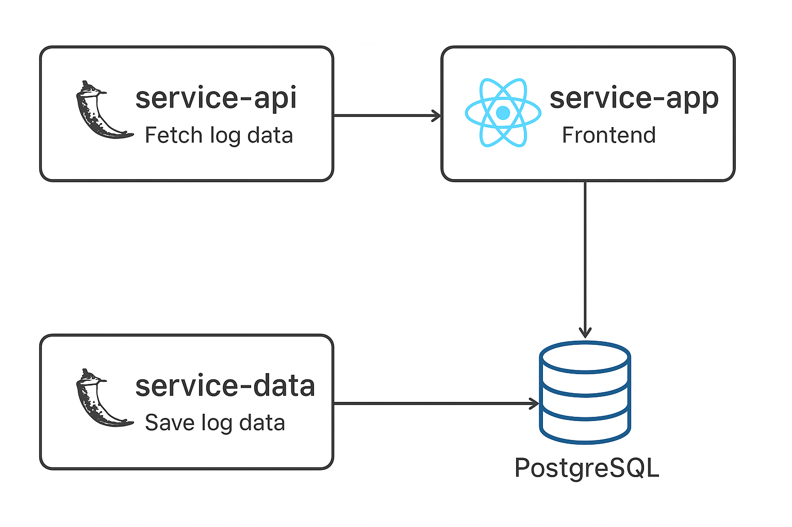

# 🚀 DevOps Microservices Project

A complete **microservices-based DevOps project** built to demonstrate modern **DevOps practices** — from development to deployment.  
This project showcases my skills in **Docker**, **Kubernetes**, **CI/CD pipelines**, **Flask**, **React**, and **PostgreSQL**.

## Architecture Overview

- **service-api**: Built with Flask (Python) — used to fetch log data  
- **service-data**: Built with Flask (Python) — used to save and fetch log data in PostgreSQL  
- **service-app**: Frontend built with ReactJS — displays log data visually  
- **PostgreSQL**: Database used to store logs

      ┌────────────────────┐
      │   React Frontend   │
      │   (service-app)    │
      └────────┬───────────┘
               │ REST API Calls
      ┌────────▼───────────┐
      │   service-api      │──► Fetches log data
      └────────┬───────────┘
               │
      ┌────────▼───────────┐
      │   service-data     │──► Handles DB operations
      └────────┬───────────┘
               │
      ┌────────▼───────────┐
      │     PostgreSQL     │
      └────────────────────┘


All components are containerized with **Docker**, managed by **Docker Compose**, and orchestrated with **Kubernetes**.

---

## 🧠 Tech Stack

| Layer | Technology |
|-------|-------------|
| **Frontend** | React.js |
| **Backend APIs** | Flask (Python) |
| **Database** | PostgreSQL |
| **Containerization** | Docker, Docker Compose |
| **Orchestration** | Kubernetes |
| **CI/CD** | GitHub Actions |
| **Monitoring (Optional)** | Prometheus + Grafana |
| **Version Control** | Git & GitHub |

---

## ⚙️ Microservices Description

| Service | Description | Port | Tech |
|----------|--------------|------|------|
| `service-api` | Fetches and exposes log data via REST API | `5000` | Flask |
| `service-data` | Handles saving/retrieving log data from PostgreSQL | `5001` | Flask |
| `service-app` | React frontend that displays logs and interacts with APIs | `3000` | React.js |
| `postgres` | Persistent database for microservices | `5432` | PostgreSQL |

---

## 🗂️ Project Structure

```
/devops-microservices/
├── service-api/
├── service-data/
├── service-app/
├── postgres/
├── k8s/
├── docker-compose.yml
├── .env.example
├── .gitignore
├── Makefile
├── docs/
│ └── architecture.png
└── README.md
```

## Diagram

